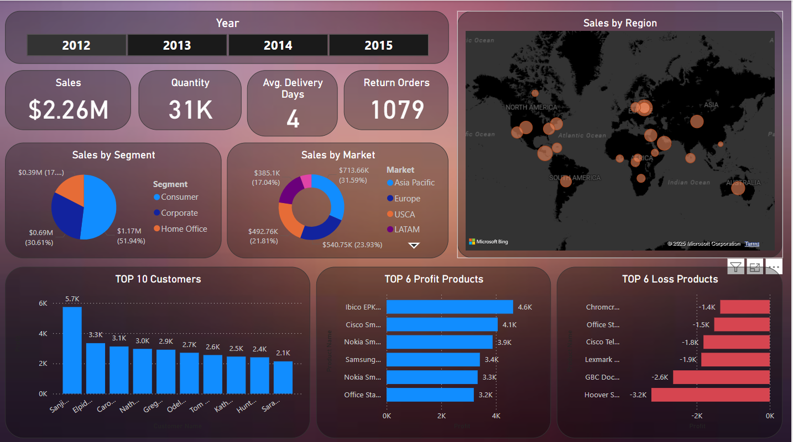
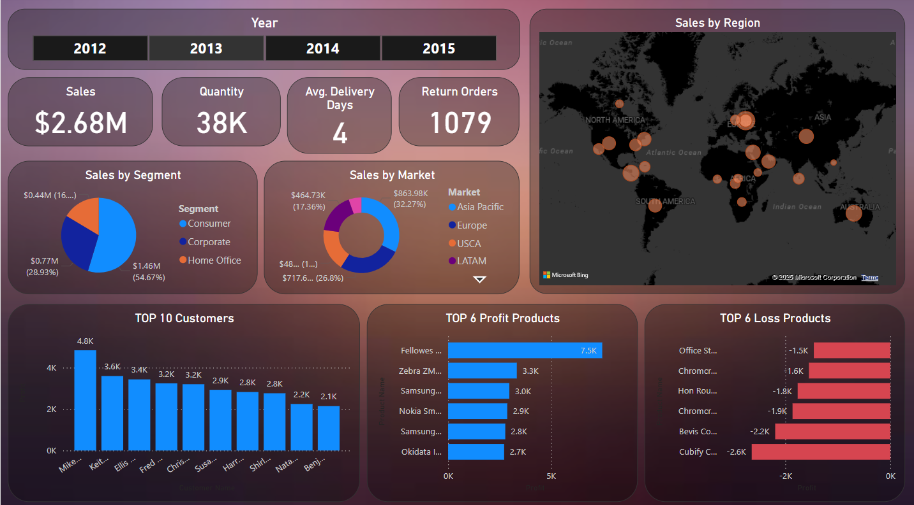
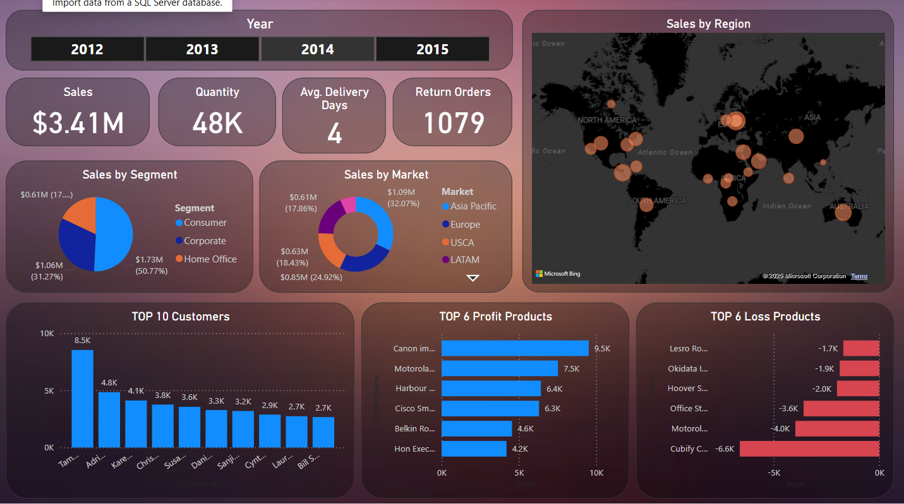

# Power BI Sales Dashboard - Global Super Store

## 📌 Project Overview
This project involves building an **interactive Power BI Sales Dashboard** using **Global Super Store** sales data. The dashboard provides valuable insights by transforming raw data into meaningful visualizations.

## 🔍 Key Features
- **ETL Process:** Data extraction, transformation, and loading performed as per requirements.
- **Data Cleaning & Transformation:** Used **Power Query** to clean and shape the dataset.
- **DAX Measures & Calculations:** Created calculated measures and columns for advanced analysis.
- **Interactive Visualizations:** Implemented charts, slicers, and cards for better data representation.
- **User-Friendly Report:** Designed for easy interpretation and decision-making by end-users.

## 📊 Dashboard Preview

## 📁 Dataset
The dataset used is the **Global Super Store Sales Data**, which contains details about orders, customers, products, and sales across different regions.

## 🔧 Tools & Technologies
- **Power BI** (for dashboard creation)
- **Power Query** (for data transformation)
- **DAX (Data Analysis Expressions)** (for calculated measures and columns)

## 📈 Insights Derived
- Sales trends across different regions.
- Performance analysis of product categories.
- Customer segmentation based on purchasing behavior.
- Order profitability insights.

## 📷 Screenshots

### Year-wise Sales Dashboards
- **2012 Sales Dashboard**  
  

- **2013 Sales Dashboard**  
  

- **2014 Sales Dashboard**  
  

## 🚀 How to Use
1. Download the `.pbix` file from this repository.
2. Open it using **Power BI Desktop**.
3. Explore the interactive visuals and gain insights.

## 📌 Future Enhancements
- Adding predictive analysis using **machine learning models**.
- Integrating real-time data updates.
- Implementing **Power BI Service** for web-based access.
